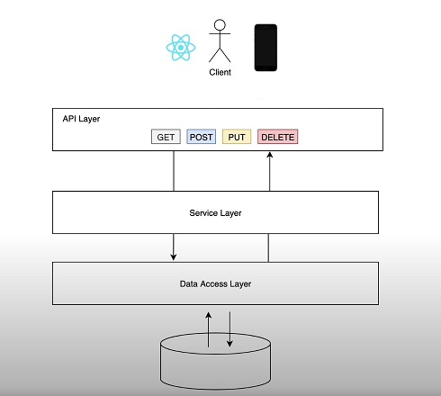

# demo-project-springboot
**A simply demo to better understand Springboot**

**About this project**

It's a little REST project based on Springboot. The application follows the MVC pattern, with an API layer, Service layer and Data Access layer.

There's just one Entity called Student and a Student Controller to create, read, update or delete a Student.

This demo is based on amigoscode course called **"Getting Started with Spring Boot"**.

You can check it at: https://amigoscode.com/courses/
